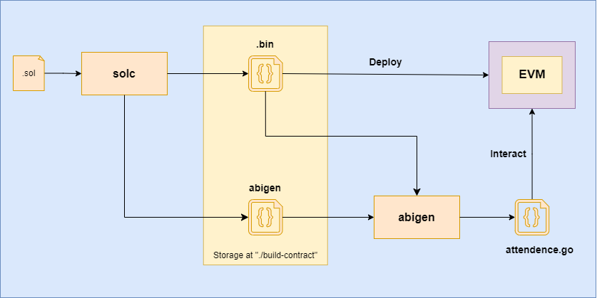
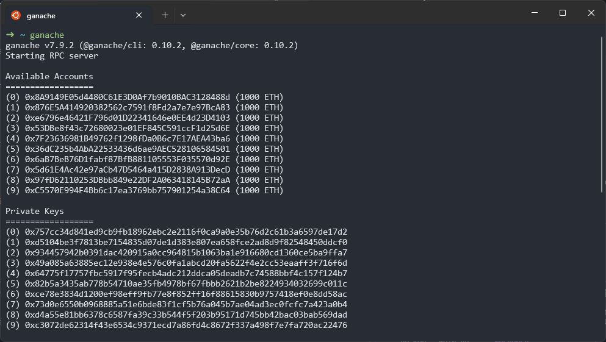
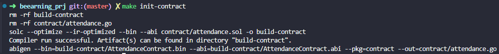
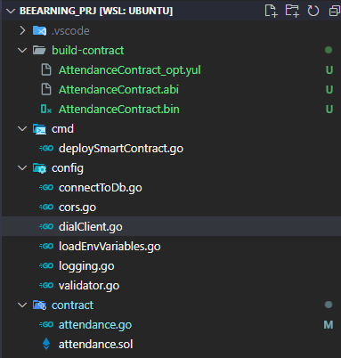
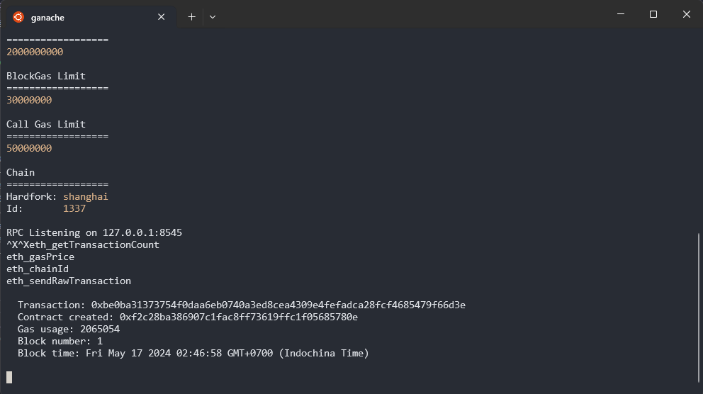
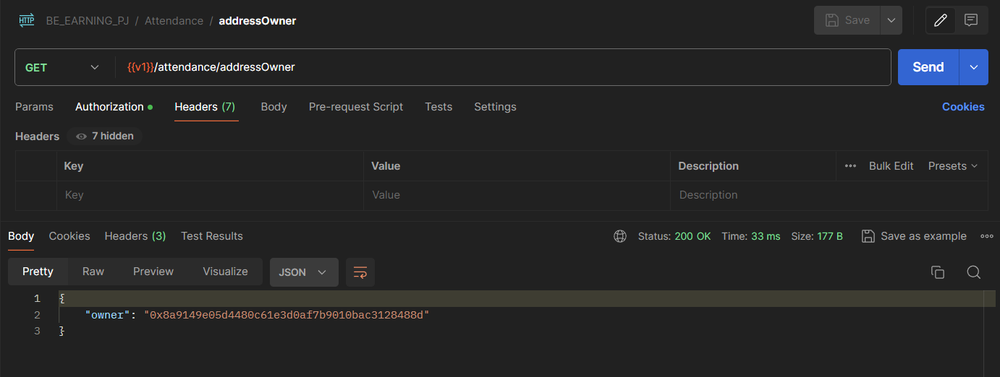
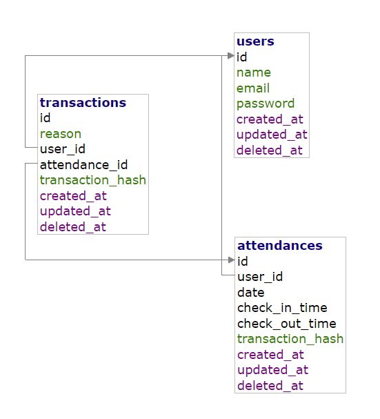

# Overview System
A DApp manages employee attendance and details using Golang and Solidity.

## Solution Architecture

Backend sử dụng ngôn ngữ Go và thư viện go-ethereum để tương tác với smart contract trên mạng Ethereum. Sự tương tác này cho phép backend gửi và nhận dữ liệu từ smart contract, thực hiện các hoạt động như đọc và ghi dữ liệu, và thực hiện các hành động thông qua các hàm được xác định trong smart contract.

Để tương tác giữa Backend và Etherium cần thực hiện các bước sau:

1. Thiết lập một kết nối với mạng Etherium thông qua PRC endpoint.
2. Backend gửi và nhận dữ liệu từ smart contract, thực hiện đọc và ghi dữ liệu, và thực hiện hành động thông qua các hàm trong smart contract.
    
    **Lưu ý:** Các hàm này được build từ file `.sol` - Solidity. Chi tiết [Deploy Solidity]()

Kết nối này được thiết lập qua JSON-PRC và transaction Ethereum.

## Smart Contract

### 1. Attendance Management
Dựa trên requirement. Ta có một số giả định như sau:
1. Với mỗi ngày, user chỉ có thể thực hiện duy nhất một action CHECKIN (tương tự với CHECKOUT)
2. Thời gian làm việc của một ngày trong vòng từ 00:00 -> 24:00.

Dựa trên giả định trên, `struct` cần thiết cho hệ thống `attendance` bao gồm:
- **date**
    - Chỉ lưu thông tin ngày, với format: `YYYYMMDD`. Ví dụ ngày `15/05/2024` sẽ được biến đổi thành `20240515`
    - Kiểu dự liệu `uint32`, trong khoảng từ `00010101` đến `99990101`
- **checkInTime**
    - Lưu thời gian checkIn đơn vị là giây (seconds)
    - Kiểu dữ liệu `uint32`, trong khoảng từ `0` (00:00:00) đến `24*60*60-1` (23:59:59)
- **checkOutTime** Tương tự với *checkInTime*.

Đây là 3 field chính để lưu thông tin *Attendance* của user.

```solidity
struct AttendanceData {
    uint32 date; // Format: YYYYMMDD
    uint32 checkInTime; // Time in seconds MIN_TIME -> MAX_TIME
    uint32 checkOutTime; // Time in seconds MIN_TIME -> MAX_TIME
    RelevantDetails releventDetails;
}
```

**Notes**
- Đối với *struct AttendanceData* chỉ lưu lại thông tin checkInTime/checkOutTime **mới nhất**.

### 2. Authentication & Authorization
- Khi một user deploy smart-contract, hệ thống sẽ xác nhận **Account Address** khi thực hiện deploy là **Owner** của Smart Contract.
- Chỉ có **Owner** mới có thể thực hiện **CheckIn**, **CheckOut**, **Update** cho Employee.
- Ngoài ra **Owner** có thể thể thay đổi người Owner Smart Contract.

    ```solidity
    address private owner;
    ...
    /**
     * @dev Set contract deployer as owner
     */
    constructor() {
        owner = msg.sender; // 'msg.sender' is sender of current call, contract deployer for a constructor
        emit OwnerSet(address(0), owner);
    }
    ```
### 3. Relevant Details
Dựa trên design *Figma* ta sẽ có thể lưu một số thông tin khác như:

- Address: Địa chỉ nơi Employee thực hiện CheckIn.
    - Ngoài ra, trong trường hợp Employee đến sai nơi làm việc cần bổ sung thêm một số thông tin khác như: *Ảnh Khu Vực Đến*, *Ghi chú*.
- Trong trường hợp Employee cần update thông tin Checkin/Checkout sẽ cần bổ sung thông tin **Nguyên Nhân**. 


```solidity
struct AddressInfo {
    string label;
    string details;
    int256 lat;
    int256 long;
}
struct RelevantDetails {
    AddressInfo addressInfo;
    string[] imgs;
    string note;
}

struct History {
    uint32 checkInTime;
    uint32 checkOutTime;
    string reason;
}
```

### 4. Summary
Dựa trên requirement, và các `struct` design, ta sẽ mapping dữ liệu dựa trên EmployeeID.
```solidity
    // Mapping employee ID to their attendance records
    mapping(uint256 => AttendanceData[]) private attendances;
    mapping(uint256 => mapping(uint32 => uint256)) private mappingDateToIndex;

    // Mapping employee IDs & index of attendance records to their attendance records changes
    mapping(uint256 => mapping(uint256 => History[])) private histories;
```

- **attendances** dựa trên `EmployeeID` ta sẽ ánh xạ được thông tin Attendance và Relevant Details.
- **mappingDateToIndex** dựa trên cặp giá trị `(EmployeeId, Date)` ta sẽ ánh xạ được vị trí records trong biến `attendances`
    - Vì ta có giả định mỗi ngày Employee chỉ có một record dành cho CHECKIN và CHECKOUT. Nên cặp giá trị `(EmployeeId, Date)` là `unique`.
- **histories** Lưu thông tin thay đổi attendance dựa trên cặp giá trị `(EmployeeId, Date)`


## Deploy Solidity
Để thực hiện Deploy Solidity ta cần có các thông tin sau:
- PRIVATE_KEY: Được sử dụng để xác định owner của contract.
- DIAL_CLIENT: ETH Network để connect và deploy



Để deploy smart contract, đầu tiên ta cần sử dụng tool `solc` để tiến hành compile thành file `.bin` và `.abi`. Trong đó
- `.bin` Bytecode này là phiên bản thực thi của smart contract trên nền tảng Ethereum. File `.bin` chứa mã máy ảo Ethereum (EVM) deploy trên mạng Ethereum.
- `.abi` là một công cụ được cung cấp bởi go-ethereum để tạo ra các gói Go (Go packages) từ smart contract Solidity.

Tiếp đến ta cần sử dụng thêm tool `abigen` để sử dụng file `.bin` và file `.abi` của smart contract để tạo ra các gói Go chứa các hàm và cấu trúc tương ứng với smart contract. Các gói Go này cung cấp một giao diện thuận tiện để tương tác với smart contract từ backend Go, giúp đơn giản hóa việc tương tác và triển khai smart contract trên mạng Ethereum.

Sau khi build thành công file `attendance.go` từ `attendance.sol`, ta có thể deploy smart contract một các đơn giản thông qua `func DeployContract` đã được generate.

**Ví dụ**: Đoạn code thực hiện deploy smart contract thông qua `func DeployContract` từ `attendance.go` file.
```go
// cmd/deploySmartContract.go
func deployContract(client *ethclient.Client) (common.Address, *types.Transaction, error) {
	auth := config.AuthGenerator(client)
	contract, transaction, _, err := contract.DeployContract(auth, client)
	return contract, transaction, err
}
```

### Steps by steps for deploying the smart contract.
Để test ở local sử dụng `ganache`

1. Khởi tạo RPC server.

    Đầu tiên ta cần khởi tạo RPC Server bằng cách mở terminal và thực hiện lệnh `ganache`.

    

2. Update `.env`
    - `BC_DIAL_CLIENT`: `127.0.0.1:8545`
    - `BC_ACCOUNT_PRIVATE_KEY`: `757cc34d841ed9cb9fb18962ebc2e2116f0ca9a0e35b76d2c61b3a6597de17d2`

    Sử dụng `PRIVATE KEY` của một account bất kỳ được `ganache` khởi tạo.
    Với `PRIVATE_KEY` trên ta có ACCOUNT:
        ACCOUNT: `0x8A9149E05d4480C61E3D0Af7b9010BAC3128488d`

3. Run command: `make init-contract`
    
    - Hệ thống sẽ tiến hành generate ra các file sau:
        1. `build-contract/AttendanceContract.abi`
        2. `build-contract/AttendanceContract.bin`
        3. `contract/attendance.go`

    

4. Run command: `make deploy-contract`
    Sau khi execute thành công hệ thống sẽ generate một file tạo thư mục `./logs`
    
    Format: `deploy_smart_contract_YYYY-MM-dd_hh:mm:ss.log`

    Chứa 2 thông tin chính:
    - Contract Address
    - Transaction Hash

    ```
        2024/05/17 02:46:58 Transaction has been committed!!
        2024/05/17 02:46:58 --------------------------------
        2024/05/17 02:46:58 Contract Address: 0xF2C28ba386907C1Fac8Ff73619FFc1F05685780E
        2024/05/17 02:46:58 -----------------
        2024/05/17 02:46:58 Transaction Hash: 0xbe0ba31373754f0daa6eb0740a3ed8cea4309e4fefadca28fcf4685479f66d3e
        2024/05/17 02:46:58 -----------------
    ```

    Kiểm tra `console` của `ganache`:
    
5. Update `.env` và verify smart contract.
    Update giá trị
        `BC_CONTRACT_ADDRESS`=`0xF2C28ba386907C1Fac8Ff73619FFc1F05685780E`

    Để kiểm tra smart contract đã deploy hay chưa, ta tiến hành call API đơn `GET Owner Address`
    

    Tương với `ACCOUNT` sử dụng `PRIVATE_KEY` được sử dụng ở Bước 1.
    - `ACCOUNT: 0x8A9149E05d4480C61E3D0Af7b9010BAC3128488d`

Như vậy ta đã deploy thành công smart contract ở local env.

## Interact Smart Contract
Để tương tác với smart contract ta cần phải nắm vững interface của func được generate từ Solidity.

Ví dụ: Func `checkin` của Solidity sẽ được convert sang Golang:

**Solidity**

```solidity
    /**
    * @dev Check in function for employees
    * @param employeeID The ID of the employee
    * @param date The date of the attendance record
    * @param checkInTime The check-in time
    * @param relevantDetails Relevant details associated with the attendance
    */
    function checkin(
        uint256 employeeID,
        uint32 date,
        uint32 checkInTime,
        RelevantDetails memory relevantDetails
    ) public isOwner {
        ...
    }
```

**Golang**

```go
    // Checkin is a paid mutator transaction binding the contract method 0x1d848671.
    //
    // Solidity: function checkin(uint256 employeeID, uint32 date, uint32 checkInTime, ((string,string,uint32,uint32),string[],string) relevantDetails) returns()
    func (_Contract *ContractTransactor) Checkin(opts *bind.TransactOpts, employeeID *big.Int, date uint32, checkInTime uint32, relevantDetails RelevantDetails) (*types.Transaction, error) {
        return _Contract.contract.Transact(opts, "checkin", employeeID, date, checkInTime, relevantDetails)
    }
```

Khi cần thực hiện action `checkin` ta thực hiện như sau:

**Lưu ý:** Cần phải *convert* loại dữ liệu đúng với interface.
```go
func AttendanceCheckIn(userId uint, data *dto.CheckInDTO) (*models.Attendance, error) {
	employeeID := helpers.ConvertUintToBigInt(userId)

	var relevantDetails contract.RelevantDetails
	relevantDetails.AddressInfo.Label = data.RelevantDetails.AddressInfo.Label
	relevantDetails.AddressInfo.Details = data.RelevantDetails.AddressInfo.Details
	relevantDetails.AddressInfo.Long = data.RelevantDetails.AddressInfo.Long
	relevantDetails.AddressInfo.Lat = data.RelevantDetails.AddressInfo.Lat

	relevantDetails.Imgs = data.RelevantDetails.Imgs
	relevantDetails.Note = data.RelevantDetails.Note

	auth := config.AuthGenerator(config.ETH_CLIENT)
	result, err := config.ATTENDANCE_CONTRACT_INSTANCE.Checkin(
		auth,
		employeeID,
		data.Date,
		data.CheckInTime,
		relevantDetails,
	)
	if err != nil {
		return nil, err
	}


	// Storage Attendance to DB
	attendance := &models.Attendance{
		UserID:       userId,
		Date:         data.Date,
		CheckInTime:  data.CheckInTime,
		CheckOutTime: 0,
	}

	transactionHash := result.Hash().String()

	err = attendance.CheckInAttendance(config.DB, transactionHash)
	return attendance, err
}
```

References:
- Solidity: contract/attendance.sol
- Go: contract/attendance.go

## Backend

### Project Struct
```
project/
├── cmd/
├── config/
├── contract/
├── controllers/
├── deploy/
├── docs/
├── dto/
├── helpers/
├── logs/
├── middlewares/
├── migrations/
│   └── db
├── response/
├── route/
├── services/
└── main.go

```
Trong đó:
- `cmd`: Chứa lệnh command của dự án, Ex: deploy smart contract.
- `config`: Chứa các file liên quan đến config
- `contract`: Chứa thông tin smart contract: `.sol` và file `.go` được generate từ `abigen`
- `controllers`: Thực hiện điều hướng routes.
- `docs`: Chứa file tài liệu về system, API design.
- `dto`: Chứa file cấu trúc dữ liệu request (data transfer objects) được sử dụng để convert json thành objects đồng thời validate.
- `helpers`: Chứa các helpers functions.
- `logs`: Chứa các file liên quan đê nghi log của ứng dụng.
- `middlewares`: Chứa middlewares: Authentications, ...
- `migrations`: Chứa file SQL schema để init dự án và file SQL thực hiện migration db.
- `response`: Chứa các wrap-up format response data.
- `route`: Định nghĩa route API
- `services`: Xử lý `bisiness logic` cho hệ thống.
- `main.go`: Entry point


### API
Đảm bảo rằng API của bạn tuân thủ các nguyên tắc thiết kế RESTful. Sử dụng các phương thức HTTP như GET, POST, PUT và DELETE để thực hiện các hành động tương ứng trên tài nguyên.

* Version: prefix  `api/v1`
* Authentication: `Bearer Token`
* Request: Sử dụng `JSON`
* Response: Sử dụng `JSON`, với template 2 case Succeed & Error như sau:
    * Succeed:
        
        Status Code: 200
        ```json
        {
            "data": {
                "id": 17,
                "DeletedAt": null,
                "UserID": 1,
                "Date": 20240103,
                "CheckInTime": 1,
                "CheckOutTime": 1
            },
            "result": "SUCCEED"
        }
        ```
    * Error:
        
        Status Code: 400
        ```json
        {
            "message": "Message error",
            "result": "ERROR"
        }
        ```

Chi tiết API Design Tham khảo: [Postman API]()

### DB Diagram
Vì thông tin chi tiết đã được lưu chi tiết ở smart contract, ở `backend` sẽ lưu một số thông tin cơ bản vào 3 table như sau:


1. **users**
    - Lưu thông tin chính của user. Giá trị `users.id` được sử dụng tương tự với `EmployyeeID` của Smart Contract.
    - Thực hiện chức năng chính: `Singup`, `Login`, `Profile`.
2. **attendances**
    - Lưu thông tin `latest attendance`, ý nghĩa các field tương tự thiết kế **Smart Contract**.
    - Thực hiện lưu trữ thông tin: `Checkin`, `Checkout`, `Update Attendance`.
3. **transactions**
    - Lưu thông tin `transaction` đặt biệt là `transaction hash` sau khi thực hiện call lên **Smart Contract**.
    - Field `transaction.reason` lưu 3 giá trị, tương ứng với 3 action user có thể tương tác với `attendance`: CHECKIN, CHECKOUT, UPDATE

### Steps by steps for start Backend.
Đảm bảo môi trường đã cài đặt môi trường như sau:
- Go: `go1.22.2 linux/amd64`
- Docker: `25.0.3, build 4debf41`
- Node: `v18.18.0`
- Solc: `0.8.25+commit.b61c2a91.Linux.g++`
- Abigen: `1.14.3-stable`
- [Migrate](https://pkg.go.dev/github.com/golang-migrate/migrate/v4) `4.17.1`
- Và deploy thành công smart contract.

1. Start Postgres & Adminer for Database
    ```bash
    make up
    ```

2. Init database
    ```bash
    make migrate up
    ```
    Or execute SQL queries directly at `migrations/init.sql` 

3. Run app on local
    ```bash
    make dev
    ```

    The application will run on `PORT` has been defined in `.env`.

4. Verify
```
curl --location 'localhost:8081/api/v1/ping'
```

Kết quả:
```
➜  beearning_prj git:(master) ✗ curl --location 'localhost:8081/api/v1/ping'
OK
```

## Limitation
Vì thời gian thực hiện chỉ vỏn vẹn trong 3 ngày, nên source code còn một số khuyết điểm như sau:
- Valiation
    - Sử dụng Message mặc định của framework. Cần optimize để message mang tính `readable`
    - Chưa thực hiện vaidation đầy đủ tất cả use-case. Ví dụ giá trị input đầu vào là `20240150`. Tương đương với ngày `50-01-2024` => ngày không hợp lệ.
- Uint Test
    - Không có unit test trên `Solidity` và `Backend`.